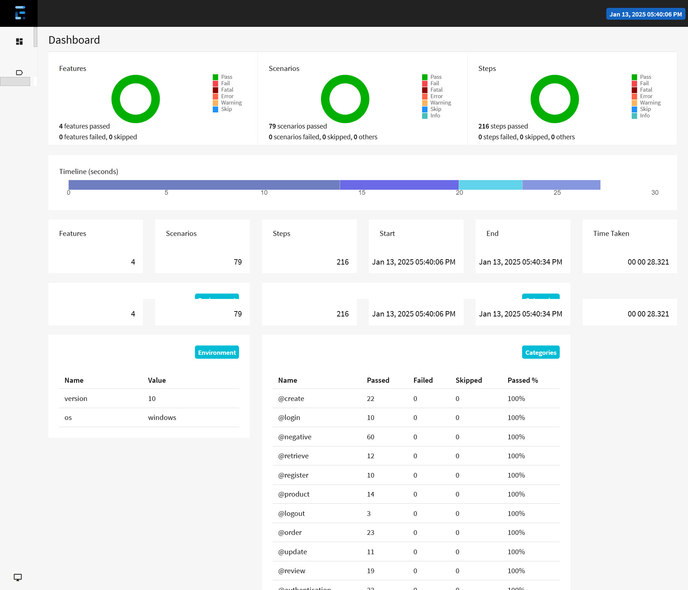

# Store API Test Automation Framework

## Overview

This framework is designed to test the **Authentication API**, **Product API**, **Order API**, and **Review API** using **Cucumber**, **JUnit**, and **RestAssured**. It validates the various operations related to user registration, login, logout, order management, product handling, review management, and error handling. The tests are written using Cucumber's Gherkin syntax, and the framework is organized to facilitate running API tests efficiently.

## Features

- **Authentication API**:
   - User registration, login, and logout functionalities.
   - Error handling for invalid inputs and missing fields.

- **Product API**:
   - Operations for creating, updating, retrieving, and deleting products.
   - Validation of success and failure responses for product actions.

- **Order API**:
   - Endpoints for creating, updating, and deleting orders.
   - Testing order creation and retrieval functionality.

- **Review API**:
   - Operations to create, update, retrieve, and delete reviews for products.
   - Handling of valid and invalid review submissions.

[comment]: <> (- **Tags**: Each scenario is tagged with specific categories like `register`, `login`, `positive`, `negative`, and `regression` to enable selective execution of tests.)

## Table of Contents

1. [Prerequisites](#prerequisites)
2. [Setup](#setup)
3. [Directory Structure](#directory-structure)
4. [Running the Tests](#running-the-tests)
5. [Test Structure](#test-structure)
6. [Configuration](#configuration)
7. [Tagging Convention](#tagging-convention)
8. [License](#license)

## Prerequisites

Before running the tests, ensure that the following dependencies are installed:

- **Java 8+**
- **Maven** (to manage dependencies and build the project)
- **Cucumber** (for behavior-driven testing)
- **JUnit** (for running tests)
- **RestAssured** (for making API requests and validating responses)
- **IDE** (e.g., IntelliJ IDEA, Eclipse) for development and test execution

## Setup

1. Clone the repository:
    ```bash
    git clone <repository-url>
    cd <project-folder>
    ```

2. Install Maven dependencies:
    ```bash
    mvn install
    ```

3. If you use an IDE, import the project as a Maven project.

## Directory Structure

The project is structured as follows:
```
.
├── pom.xml
├── src
│   ├── main
│   │   └── java
│   │       └── com
│   │           └── store
│   │               ├── api
│   │               │   ├── AuthenticationApi.java
│   │               │   ├── OrderApi.java
│   │               │   ├── ProductApi.java
│   │               │   └── ReviewApi.java
│   │               ├── enums
│   │               │   └── Context.java
│   │               ├── model
│   │               │   ├── Order.java
│   │               │   ├── Product.java
│   │               │   └── Review.java
│   │               │   └── User.java
│   │               └── utils
│   │                   ├── MockServer.java
│   │                   ├── ScenarioContext.java
│   │                   └── ConfigReader.java
│   │────────resources
│   │        └── endpoint.yml
│   ├── test
│   │   └── java
│   │       └── com
│   │           └── store
│   │               ├── features
│   │               │   ├── Authentication.feature
│   │               │   ├── Order.feature
│   │               │   ├── Product.feature
│   │               │   └── Review.feature
│   │               ├── steps
│   │               │   ├── AuthenticationSteps.java
│   │               │   ├── OrderSteps.java
│   │               │   ├── Hooks.java
│   │               │   ├── ProductSteps.java
│   │               │   └── ReviewSteps.java
│   │               └── runner
│   │                   └── TestRunner.java
│   │────────resources
│   │        └── extent.properties
```

## Running the Tests

### Using Maven

To run the tests via Maven, use the following command:

```bash
mvn test
```
This command will trigger Cucumber to run all feature files in the project, and the results will be displayed in the terminal.

### Generating Test Reports

You can generate a test report by running:

```bash
mvn clean test
```

This will create a detailed test report under the `target` directory.

### Execution Result



## Test Structure

The test cases are written in Cucumber using Gherkin syntax. Each scenario corresponds to a specific API test, with `Given`, `When`, Then` steps to define the actions and validations.

### Example Scenario

```gherkin
@authentication @register @positive
Scenario: TC_1 User can successfully register with valid data
Given I register with username "validUser1", password "password1" and email "email1"
Then the registration should be successful
```

- **Given**: Sets up the preconditions (e.g., user registration data).
- **When**: Specifies the action to perform (e.g., making an API call).
- **Then**: Validates the expected outcome (e.g., success or error).

## Configuration

The `envconfig.yaml` file allows you to configure environment-specific settings such as the API base URL for each environment and the API endpoints for different resources like authentication, products, reviews, and orders.

## Tagging Convention

Each scenario is tagged with specific labels for better organization:

- **@register**: For test cases related to user registration.
- **@login**: For test cases related to user login.
- **@logout**: For test cases related to user logout.
- **@product**: For test cases related to product operations (create, update, delete).
- **@order**: For test cases related to order creation and management.
- **@review**: For test cases related to review creation and management.
- **@positive**: For scenarios where the API behavior is expected to be successful.
- **@negative**: For scenarios where the API should fail (invalid data, missing fields, etc.).
- **@regression**: For regression tests that should be executed as part of the continuous testing process.

## License

This project is licensed under the MIT License

